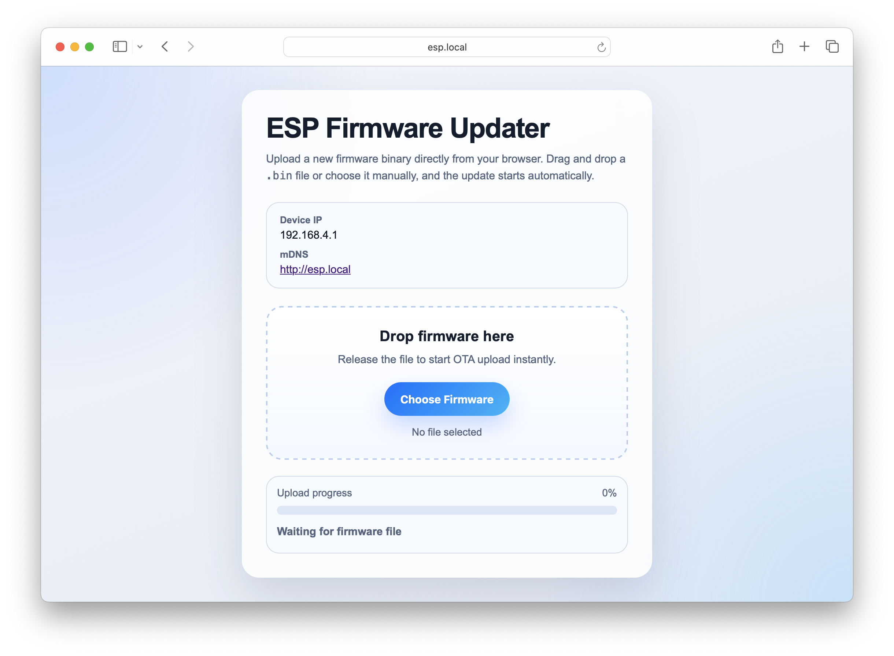

# ESP OTA Firmware Updater

Production-ready OTA updater for ESP8266 and ESP32 on PlatformIO with Arduino framework.

The firmware starts an access point, exposes a web UI at `http://esp.local` and allows uploading a new firmware binary directly from the browser.



- For `ESP8266` and `ESP32`
- Access Point mode with SSID `ESP-Setup`
- Optional AP password via `#define AP_PASSWORD ""`
- mDNS hostname `esp` with access at `http://esp.local`
- Built-in web server on port `80`
- Automatic reboot 2 seconds after successful update
- Serial debug output for Wi-Fi, mDNS, HTTP and OTA stages

## Supported environments

Configured in [`platformio.ini`](platformio.ini):

- `esp01` for ESP8266
- `esp32dev` and `esp32s3` for ESP32

## Project structure

- [`src/main.cpp`](src/main.cpp): main firmware logic, AP setup, mDNS, web server and OTA handler
- [`include/web_page.h`](include/web_page.h): inline HTML/CSS/JS template for the web interface
- [`platformio.ini`](platformio.ini): PlatformIO environments

## Requirements

- [PlatformIO](https://platformio.org/)
- Arduino framework
- Supported board for one of the configured environments

## Configuration

Main runtime configuration is kept in [`src/main.cpp`](src/main.cpp):

```cpp
#define AP_PASSWORD ""
```

If `AP_PASSWORD` is empty, the access point is open.

Default network settings:

- SSID: `ESP-Setup`
- mDNS hostname: `esp`
- Web UI: `http://esp.local`